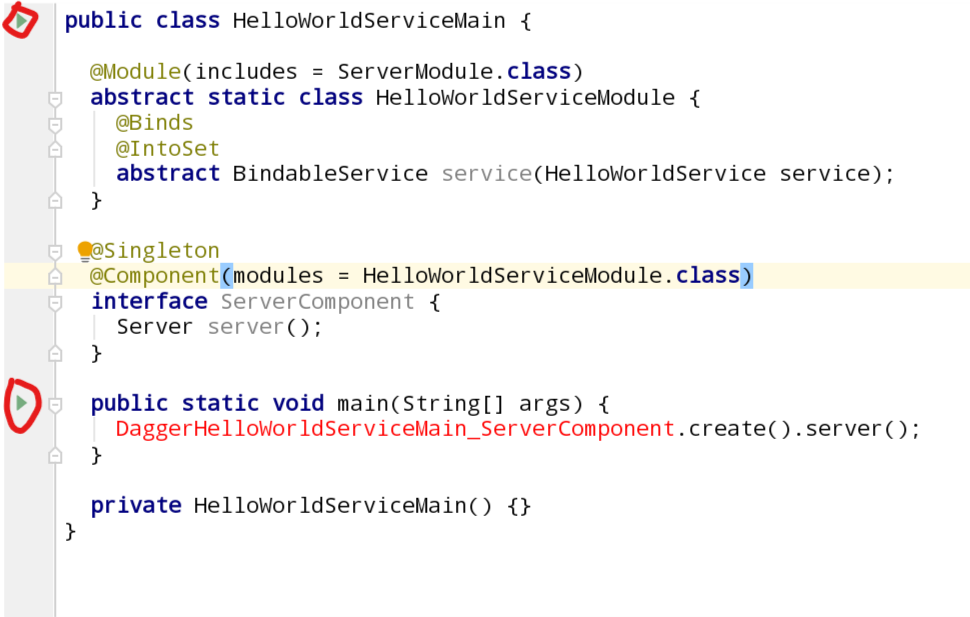
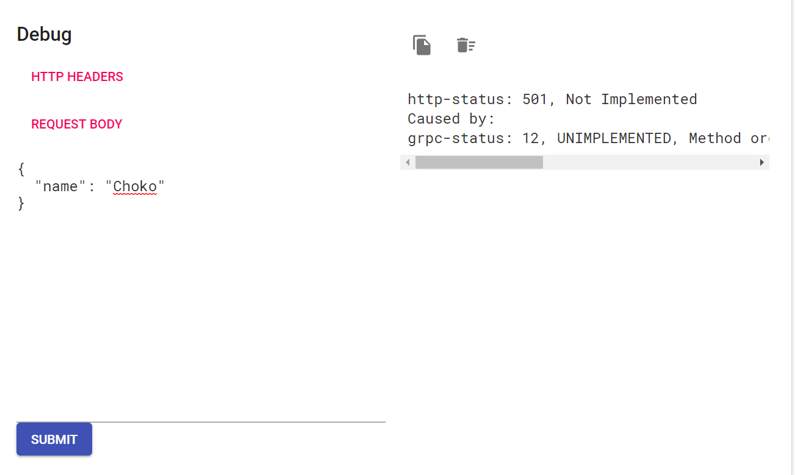
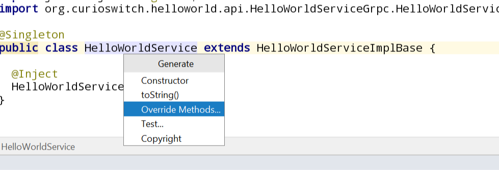
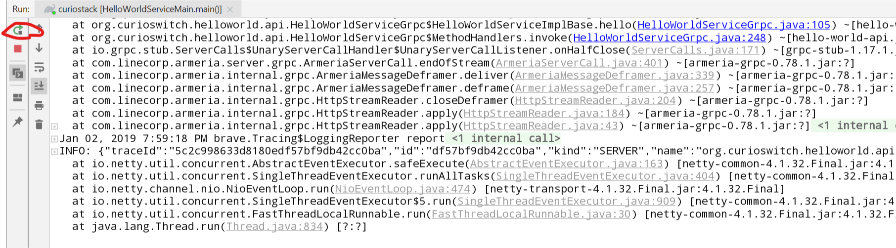

# Implementing an API Server

[Codelab Feedback](https://github.com/curioswitch/curiostack/issues/new)


## Introduction

CurioStack encourages developing systems composed of many different server processes, each with a limited, well defined scope of functionality. For example, there may be a server dedicated to providing authentication for users, another may fetch user data from a database and generate recommendations, and another may take login information from a user, verify using the authentication server, retrieve recommendations from the recommendations server, and render them into an HTML page to show to the user.

In such a system, each server exposes an API - the API defines methods that can be run from a different server. This lab walks you through implementing the business logic for an API in Java using gRPC.

This codelab is intended to be started after completing [Defining a gRPC API](../defining-a-grpc-api).

### **What you'll learn**

* How to implement methods of a gRPC API
* Basics of dependency injection
* Overview of curio-server-framework

### **What you'll need**

* A CurioStack-based code repository clone
* IntelliJ


## Examining generated boilerplate

In the codelab, [Defining a gRPC API](../defining-a-grpc-api/#1), you should have generated boilerplate for the API server using the command `generateApiServer`. If you haven't done so yet or have deleted the generated code, run the command again following the instructions in that codelab.

Let's take a look at the boilerplate code generated when setting up the API server, in the `server` subdirectory of the folder specified above.

### **Gradle Configuration**

All projects in Gradle contain a `build.gradle.kts` file to define the project. We've created a separate project for the server here because while the API is used in multiple places, the implementation of the API is only needed in this API server itself. Clients can import the API definition without importing the implementation as well because we've separated the projects.

Let's take a look at the `build.gradle.kts` file. Comments explaining each line have been added to this snippet.

#### build.gradle.kts

```
plugins {
    // The curio-server-plugin is applied to any API server in a CurioStack codebase. This plugin
    // configures the generation a container image containing the server for deploying to
    // production servers. We will go into more detail about deployment in another codelab. 
    id("org.curioswitch.gradle-curio-server-plugin")
}

base {
    // The name of the archive that will contain the server code. This is also used to identify the
    // container image when deploying, and thus must be unique throughout the codebase.
    archivesBaseName = "hello-world-server"
}

application {
    // This is the class with Java main entrypoint method.
    mainClassName = "org.curioswitch.helloworld.server.HelloWorldServiceMain"
}

dependencies {
    // All users of the API need to have a dependency on it, including this server that implements
    // it. 
    compile(project(":hello:world:api"))

    // curio-server-framework contains common business logic for implementing an API server that
    // has minimal boilerplate and follows the best practices. We'll go through some of these
    // features later in the codelab.
    compile("org.curioswitch.curiostack:curio-server-framework")

    // curio-server-framework relies heavily on Dagger and Immutables so the boilerplate adds these
    // annotation processors by default. If you don't need them, you can delete them but it is
    // highly unlikely that you would.
    annotationProcessor("com.google.dagger:dagger-compiler")
    annotationProcessor("org.immutables:value")
    compileOnly("org.immutables:value")

    testAnnotationProcessor("com.google.dagger:dagger-compiler")
    testAnnotationProcessor("org.immutables:value")
    testCompileOnly("org.immutables:value")
}
```

### **Java business logic**

Now let's look at the Java files. All files used for implementing the server go in `src/main/java`. Test files would go in `src/test/java`. Any files not in that directory will not be compiled into the server.

Negative
: Notice that the files have been added to the `server` subpackage of the API's java package. It is not strictly required to do this, but if you move or rename the files, don't forget to update `mainClassName` in `build.gradle.kts`.

The file suffixed with `Service` is the core logic for the server - all API methods will be implemented in this class. The boilerplate starts with no methods defined so there are no implemented methods in this class yet.

#### HelloWorldService.java

```
// The Java package, must match the directory structure under src/main/java
package org.curioswitch.helloworld.server;

import javax.inject.Inject;
import javax.inject.Singleton;
// This class is automatically generated by the gRPC proto compiler plugin for any service definitions
// in the proto. It is always {{ service_name }}Grpc.{{ service_name }}ImplBase.
import org.curioswitch.helloworld.api.HelloWorldServiceGrpc.HelloWorldServiceImplBase;

// @Singleton ensures that Dagger only instantiates this class once. We will talk more about Dagger
// later, but make sure classes that should only exist once in the server have this annotation.
@Singleton
public class HelloWorldService extends HelloWorldServiceImplBase {

  // @Inject allows Dagger to setup this class. We will talk more about Dagger later.
  @Inject
  HelloWorldService() {}
  
  // No methods here yet, we'll add one in this codelab.
}
```

Positive
: If this is your first time going through this code, then you may notice that IntelliJ shows a compile error related to the `ServiceImplBase` class. This is because we have not run the proto compiler yet. Don't worry about this as it will be resolved automatically soon.

Now let's look at the `Main` file, which is responsible for bootstrapping the server and starting it when the program is executed.

#### HelloWorldServiceMain.java

```
package org.curioswitch.helloworld.server;

import com.linecorp.armeria.server.Server;
import dagger.Binds;
import dagger.Component;
import dagger.Module;
import dagger.multibindings.IntoSet;
import io.grpc.BindableService;
import javax.inject.Singleton;
import org.curioswitch.common.server.framework.ServerModule;

public class HelloWorldServiceMain {

  // Indicates to Dagger to include ServerModule, which contains all the bootstrap logic of
  // curio-server-framework. We will discuss Dagger more below.
  @Module(includes = ServerModule.class)
  abstract static class HelloWorldServiceModule {

    // Exposes HelloWorldService as a BindableService for Dagger to inject into consumers. 
    // ServerModule is one such consumer - it does not know anything about HelloWorldService but
    // does know about BindableService. By mapping HelloWorldService to BindableService using this
    // pattern, ServerModule will know about the service and register it with the server.
    @Binds
    @IntoSet
    abstract BindableService service(HelloWorldService service);
  }

  // All Dagger applications must have at least one component to run dependency injection. This is
  // the server's component, and its job is to construct Server, which is the fully bootstrapped and
  // configured server.
  @Singleton
  @Component(modules = HelloWorldServiceModule.class)
  interface ServerComponent {
    Server server();
  }

  // The main method, called when executing the Java application.
  public static void main(String[] args) {
    // Dagger automatically generates this class, which wires together all of the dependency
    // injection. As ServerModule creates and starts the server as soon as its dependencies are
    // injected, this is all we need to start a fully configured server!
    DaggerHelloWorldServiceMain_ServerComponent.create().server();
  }

  private HelloWorldServiceMain() {}
}
```

Positive
: Like the service itself, this main method may show a compile error at first because it uses a class automatically generated by Dagger. It will resolve itself automatically once we run the server for the first time.

## Basics of Dagger

We have mentioned Dagger a few times so far - [Dagger](https://google.github.io/dagger/) is a dependency injection framework for Java. Dependency injection allows classes or methods to receive parameters without writing explicit code to call the constructors or methods - they are automatically generated by Dagger during compilation. The two primary parts of dependency injection are classes annotated with `@Module` and classes annotated with `@Inject` with interfaces annotated with `@Component` serving as the entry-point.

```java
@Module
class SimpleModule {
  @Qualifier
  @interface BetterGreeting {}
  
  @Provides
  static String normalGreeting() {
    return "Hello ";
  }
  
  @Provides
  static @BetterGreeting String betterGreeting() {
    return "Salutations ";
  }
  
  @Provides
  static int unused() {
    return 0;
  }
  
  @Provides
  static Void showGreetings(String normal, @BetterGreeting String better) {
    System.out.println(normal + " or " + better + "?");
    return null;
  }
}

@Component(modules = SimpleModule.class)
interface SimpleComponent {
  Void printGreetings();
}
```

To understand the dependency injection of a particular code, start from a method in the `Component`. Here, there is a method called `printGreetings` which returns `Void`. The method name itself has no meaning, Dagger only operates on types. So in this case, it will look inside all the `modules` of the `Component` for a `@Provides` method that returns type `Void`. It finds the `showGreetings` method that returns `Void` and knows it needs to be called last to execute the `Component` method. 

Next, it looks at the parameters of the method and sees one of type `String` and `@BetterGreeting String`. Again, Dagger only knows about types so the argument names don't affect it. You may want to have multiple different values of the same type available among the dependencies though - for that, we add a `@Qualifier` annotation, in this case `@BetterGreeting` to the type of the value throughout the module. Thus, you can consider the unique identifier of a dependency within the modules to be the actual Java type concatenated with any present qualifier annotations. Dagger will give a compilation error if it finds multiple values provided  with the same unique identifier.

Seeing that `showGreetings` requires a `String` and a `@BetterGreeting String`, Dagger finds `@Provides` methods that return these two types and finds `normalGreeting()` and `betterGreeting()`. Thus, it knows it should call these methods to get the values to pass to `showGreetings()`. In the end, the generated code will have similar structure to this

```java
class Dagger_SimpleComponent implements SimpleComponent {
  @Override
  Void printGreetings() {
    return showGreetings(SimpleModule.normalGreeting(), SimpleModule.betterGreeting());
  }
}
```

Notice that `unused` is not called - methods that are not required as dependencies will never be run.

A class with `@Inject` on its constructor is equivalent to an `@Provides` method - this allows conveniently setting up classes with their own business logic with a fixed set of dependencies.

```java
class Greeter {
  private final String normal;
  private final String better;
  
  @Inject
  Greeter(String normal, @BetterGreeting String better) {
    this.normal = normal;
    this.better = better;
  }
  
  public void greetNormally(String name) {
    return normal + name;
  }

  public void greetBetter(String name) {
    return better + name;
  }
}

@Component(modules = SimpleModule.class)
interface SimpleComponent {
  Greeter greeter();
}

// Generates something like this:
class Dagger_SimpleComponent implements SimpleComponent {
  @Override
  Greeter greeter() {
    return new Greeter(SimpleModule.normalGreeting(), SimpleModule.betterGreeting());
  }
}
```

Dependency injection allows classes to be tied together implicitly, usually making it easier to write test code. It also allows frameworks, like curio-server-framework, to accept parameters implicitly, reducing boilerplate code. See if you can find the logic that starts the server in our `main` method in [`ServerModule.java`](https://github.com/curioswitch/curiostack/blob/master/common/server/framework/src/main/java/org/curioswitch/common/server/framework/ServerModule.java). As you've seen, it will start with a method with the same type as that in the `Component`, in this case `Server`.

There are many more advanced usage of Dagger - take a look at the [Dagger User's Guide](https://google.github.io/dagger/users-guide) to get a better understanding of its concepts and advanced usage.

## Running the server

The generated boilerplate is actually already ready to start the server - it won't have any functionality until we implement the API method itself, but let's go ahead and run the server for the first time. As the server is just a normal Java application, it is simple to run using IntelliJ's run functionality. Open `HelloWorldServiceMain.java` and look for the green play buttons next to the class and `main` method.



Both buttons do the same thing, running the `main` method of the class. Pick one you like, click it, and select `Run ...`. This will build both the server and the API, because it is a `project` dependency of the server. You'll notice that because the previously ungenerated proto and Dagger code is now generated, the compile errors will go away.

Positive
: As Dagger generates all of its code, you can find it under the `build` directory. If you ever want to check out the generated code, go through the files under `build/generated/source/apt`. Because of Dagger's generality, and `ServerModule` exposing lots of logic through dependency injection, the classes will have a lot of unfamiliar lines. But if you look hard, you should be able to find the code flow that resembles the simplified example output we saw before.

### **Checking out default endpoints**

`curio-server-framework` bootstraps a server meant to follow best practices. This means even without any API methods defined, it provides some endpoints out of the box for things like monitoring and debugging. Let's look through some of these pages.

First, open [https://localhost:8080/internal/health](https://localhost:8080/internal/health). 

Your browser may display a security warning because this local server uses a fake TLS certificate - select proceed to go to the actual page. We know this server can be trusted since it is the localhost server we are currently running.

Positive
: You may notice that URL starts with `https`. One of the best practices `curio-server-framework` follows is TLS everywhere. There are no plain-text HTTP endpoints exposed at all. It does cause the certificate warning when running on `localhost` though. It is recommended to allow invalid certificates for `localhost` in Chrome at [chrome://flags/#allow-insecure-localhost](chrome://flags/#allow-insecure-localhost).

You'll notice the page is very simple, just showing `ok`. This page is used as the health check to ensure the current server is running and used by systems like Kubernetes to know when a server is ready to accept requests.

Next, open [https://localhost:8080/internal/metrics](https://localhost:8080/internal/metrics).

This is the metrics page, which exposes numbers about the current application for consumption by monitoring systems like Prometheus. Another codelab will go into more details about monitoring using CurioStack. One thing to keep in mind is that metrics related to any API methods you define, such as success and failure rate, will automatically be exposed on this page with no extra work.

Next, open [https://localhost:8080/internal/dropwizard](https://localhost:8080/internal/dropwizard).

This is a page that dumps textual information about the server. It's primary purpose is to know what version the current server is running at - notice the `git.commit.id` field - it can be used to identify the version of the running code.

Finally, open [https://localhost:8080/internal/docs](https://localhost:8080/internal/docs).

This is the Armeria debug page - it shows all the API methods that have been implemented in this server and allows running them with test requests. Notice that `HelloWorldService` is listed on the left with the `Hello` method that we added in the [Defining a gRPC API](../defining-a-grpc-api) codelab. Go ahead and navigate to it - you'll see that the comments we added in the proto are visible here for easy access to the documentation. Click through `HelloRequest` and `HelloResponse` too to see the documentation available for the parameters.

Navigate back to the `Hello()` page and see at the bottom that there is a section called `Debug`. Click on `Request Body` and you will see a form that can accept a JSON representation of the `HelloRequest` parameter to the method. You can see details of how to format a proto as JSON [here](https://developers.google.com/protocol-buffers/docs/proto3#json) but in general it is a straightforward JSON object with the fields. Try setting the request body to something like

```json
{
  "name": "Choko"
}
```

and press `Submit`. You just executed an API method! But you'll notice on the right that it returns as an error, `UNIMPLEMENTED`. This is because we have not actually implemented the method yet in the server. Let's go ahead and do that now.



## Implementing an API method

We're finally ready to implement the `Hello` API method. Open `HelloWorldService.java`, which holds the implementation of our API. The base class actually defines a dummy method for the `Hello` API method, using Java casing semantics and thus is called `hello()`. We just need to override it to execute our logic when the method is called.

Start by overriding the method. This is easiest by letting IntelliJ generate the override. Right-click on the class name and select Generate > Override Methods.



You'll see `hello` in the list of methods, select it and IntelliJ will create a dummy override of the method. The code in this method is what is called anytime a client, like our debug page, calls the `Hello` method. You can see that the `HelloRequest` is available as the `request` parameter and there is a `responseObserver` with an `onNext()` method that can take the `HelloResponse`. To implement an API, all we need to do is call `responseObserver.onNext()` with the desired `HelloResponse` and `responseObserver.onCompleted()`. Let's implement a simple greeting now.

#### HelloWorldService.java
```
  @Override
  public void hello(HelloRequest request, StreamObserver<HelloResponse> responseObserver) {
    String greeting = "Hello " + request.getName() + '!';
    HelloResponse response = HelloResponse.newBuilder()
        .setGreeting(greeting)
        .build();
    responseObserver.onNext(response);
    responseObserver.onCompleted();
  }
```

Now that we have implemented the method, we can try it out. Restart the server so it is rebuilt with the changed code by looking for the `Run` tab at the bottom of IntelliJ and selecting the restart button.



You will see the build process restart, this time skipping many steps that are unchanged, and the server starts again. Go back to the debug page and try the request again. Now we get the response that was generated on in our service implementation.

Congratulations, you implemented the business logic for an API method! Go ahead and play around with the implementation more, restarting the server and checking your changes with the debug page. This is the simplest way to see the results of code changes while you're developing.

In practice, your code will be much more complicated than just concatenating two strings - you'll need to fetch information from a database, or execute the methods on API clients for other services, combining the results of many independent actions into the final response. Because this can be quite complicated, it is rare to implement the actual business logic of the method inline in the `Service` class, and it is more common to have a separate class per method that holds its implementation. In another codelab, we'll look at how curio-sever-framework encourages using [Dagger Producers](https://google.github.io/dagger/producers) to stitch together unwieldy, asynchronous code. But keep in mind that in essence, the implementation of an API method is just the Java code called from the service method. Any Java code can be used and any other framework can be used too - in the end, it's just code that is called remotely.
