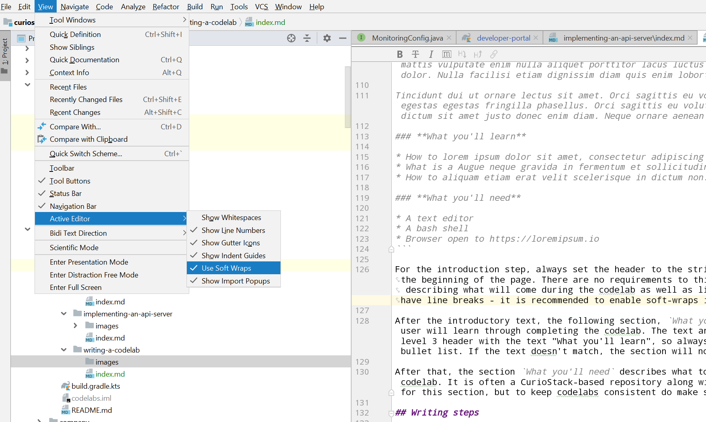

# Writing a Codelab

[Codelab Feedback](https://github.com/curioswitch/curiostack/issues/new)


## Introduction

Codelabs are the primary tool for understanding the various aspects of CurioStack - they are a structured way of learning how to conduct tasks using CurioStack. The easiest way to learn a new topic is to try it out, and codelabs encourage providing tutorials with concrete steps that users can follow along with, gradually going from basic to more advanced topics.

In this codelab, you will write a new codelab (a mouthful ;). This codelab will create content using arbitrary text, but if you have a topic in mind, it may be more enjoyable to write about it while working through this codelab. Unless text is stated as being required by the codelab formatting conventions, feel free to replace it with something for the topic you are writing about.

### **What you'll learn**

* How to write a codelab in Markdown
* How to preview a codelab within the developer portal

### **What you'll need**

* A CurioStack-based code repository clone
* A text editor
* A bash shell

## Background

CurioStack implements codelabs using the `claat` tool provided by Google. You can learn more about the tool [here](https://github.com/googlecodelabs/tools). The tool automatically converts a Google Doc or a Markdown file into a static HTML page with codelab-style formatting. The formatting is designed to guide a user through a flow of steps, and is well oriented for tutorials. There is not a big difference between `claat` and other static site generation tools but the codelab formatting works well for learning and we find it is the right tool for the job.

Note that `claat` started as a tool to convert Google Docs to codelabs, but at CurioStack we prefer to use Markdown because a Markdown file can be easily shared in a GitHub repository and the development of codelabs scaled to the entire open source community. Unfortunately, `claat`'s support for Markdown is still in-progress - most features work but some are still in development or have some issues. You will notice the biggest issue, the lack of control of code highlighting, in this codelab itself. We hope the issues will be resolved soon and in the meantime hope the issues are not distracting to the learning experience.

## Starting a new codelab

### Cloning a repository

If you already have a CurioStack-based repository, you are ready to start and skip to the next step. If you don't have one yet, you can clone the upstream repository.

    git clone 'https://github.com/chokoswitch/curiostack'

### Creating the directory

Codelabs live under the `docs/codelabs/src` folder in CurioStack. Other repositories may use a different folder layout, though it is recommended they follow the same layout as CurioStack.

You will notice folders with URL slug names, such as `defining-a-grpc-api`. Each folder corresponds to a single codelab, so for your new codelab you will also want to create a folder to correspond to it. While there is no fixed requirement that the folder name is a URL slug based on the title of the codelab, it is recommended so URLs can be more readable.

Create a folder under `docs/codelabs/src` called `my-first-codelab` (or any name you'd like if you are writing about a specific topic).

### Creating index.md

All of the content of the codelab will be written in a file called `index.md` in this directory. Let's start by creating the file and adding required metadata. Create `index.md` in the directory you created above and start by adding the following content at the top of the file.

#### index.md

```yaml
---
id: my-first-codelab
summary: In this codelab, you will find the first codelab I ever wrote. It will just be full of random strings and won't teach anything in particular.
status: [published]
author: chokoswitch
categories: Developers
tags: developers
feedback link: https://github.com/curioswitch/curiostack/issues/new
---
```

(pardon the poor code highlighting)

Codelabs are written in Markdown format with a YAML front-matter - you can see the front-matter is surrounded by `---`. Anything within the `---` is parsed as YAML and is added as metadata for the codelab. The metadata are as follows:

- id: The ID of this codelab, should match the folder name.
- summary: A brief summary of the content of this codelab. Should be around 2-3 sentences.
- status: The string [published]. CurioStack does not currently support other statuses but may in the future.
- author: The name of the author. Feel free to replace `chokoswitch` with your name.
- categories: The name of the category this codelab belongs to. The list of categories is not fixed but try looking at other codelabs for ideas of good category names.
- tags: Lowercase tags for finding this codelab.
- feedback link: A link for users to provide feedback on the codelab. Should usually be the new issue page of the repository containing the codelabs.

## Creating the introduction page

Now we're ready to add some content to the codelab. All content is written in Markdown using special Markdown formatting rules and occasionally also using specific text to indicate codelab functionality.

### Title and feedback link

All codelabs begin by defining the title of the codelab and adding a link to providing codelab feedback. Add the following to your `index.md`.

```md
# My First Codelab

[Codelab Feedback](https://github.com/curioswitch/curiostack/issues/new)
```

The title of the codelab is the first and only level 1 header (heading with a single `#`, e.g., `# My Codelab`) in the document. It is rendered in the top bar of the page and shouldn't be too long so it fits on a mobile browser.

Following that, the codelab feedback link is a standard Markdown link with the text `Codelab Feedback`. The text must match this exact string! Any other text will not be matched and the codelab will not have a feedback link rendered in the bottom of the page.

### Adding the introduction step

After defining the title, you can start adding steps for your codelab. Each step begins with a level 2 header (heading with two `#`, e.g., `## My Step`) which is displayed as the title of the page and in the table of contents on the left side. Each step is a separate page that readers will go through in order.

By convention, the very first step of a codelab is always an introduction step. Go ahead and add the following to your codelab.

#### index.md
```md
## Introduction

Lorem ipsum dolor sit amet, consectetur adipiscing elit, sed do eiusmod tempor incididunt ut labore et dolore magna aliqua. Arcu non odio euismod lacinia at quis risus sed. Ac placerat vestibulum lectus mauris ultrices eros. Amet mattis vulputate enim nulla aliquet porttitor lacus luctus accumsan. Faucibus a pellentesque sit amet porttitor eget dolor. Nulla facilisi etiam dignissim diam quis enim lobortis. Ultrices gravida dictum fusce ut placerat orci nulla.

Tincidunt dui ut ornare lectus sit amet. Orci sagittis eu volutpat odio facilisis mauris sit. Volutpat commodo sed egestas egestas fringilla phasellus. Orci sagittis eu volutpat odio facilisis mauris sit amet massa. Cursus sit amet dictum sit amet justo donec enim diam. Neque ornare aenean euismod elementum nisi quis eleifend quam.

### **What you'll learn**

* How to lorem ipsum dolor sit amet, consectetur adipiscing elit, sed do eiusmod tempor.
* What is a Augue neque gravida in fermentum et sollicitudin ac orci phasellus.
* How to aliquam etiam erat velit scelerisque in dictum non.

### **What you'll need**

* A text editor
* A bash shell
* Browser open to https://loremipsum.io
```

For the introduction step, always set the header to the string `Introduction`. The following text will be displayed at the beginning of the page. There are no requirements to this text but it is common to just have a couple of paragraphs describing what will come during the codelab as well as links to precursor codelabs. Note that the text must not have line breaks - it is recommended to enable soft-wraps in your editor. In IntelliJ, the setting is at View -> Active Editor -> Use Soft Wraps.



After the introductory text, the following section, `What you'll learn` describes what new techniques or skills the user will learn through completing the codelab. The text and formatting matters - this section must be started with a level 3 header with the text "What you'll learn", so always use the code `### **What you'll learn**` followed by a bullet list. If the text doesn't match, the section will not have special formatting using checkmarks.

After that, the section `What you'll need` describes what tools or such the user needs to have ready to go through the codelab. It is often a CurioStack-based repository along with IntelliJ and a shell. There is no special formatting for this section, but to keep codelabs consistent do make sure to use the exact formatting as above.

## Writing steps

Now that we've written an introduction step, we can get into the actual steps of the codelab. As mentioned before, a step is just a section beginning with a level 2 header (`## Step header`). Any text between that header and the next one will be rendered on the page for the step. The text is general Markdown - this codelab will not go into the details of Markdown since it is a very common format on the web now, but if you need a refresher, the [guide](https://guides.github.com/features/mastering-markdown/) by GitHub is a good summary. Here, we'll go through some of the special formatting recognized by `claat` when it renders our codelabs.

### Starting a step

Add the following to your codelab.

#### index.md
```md
## My first step
Duration: 5:30

Lorem ipsum dolor sit amet, consectetur adipiscing elit, sed do eiusmod tempor incididunt ut labore et dolore magna aliqua. Odio ut enim blandit volutpat maecenas volutpat blandit aliquam. Quam lacus suspendisse faucibus interdum posuere lorem ipsum dolor sit. Urna id volutpat lacus laoreet non curabitur gravida arcu ac. Eget arcu dictum varius duis. Eget velit aliquet sagittis id. Natoque penatibus et magnis dis parturient montes. Scelerisque in dictum non consectetur a. Id cursus metus aliquam eleifend mi in nulla posuere sollicitudin. Ut ornare lectus sit amet est placerat in egestas.

Risus nec feugiat in fermentum posuere urna. Risus sed vulputate odio ut enim blandit. Quis vel eros donec ac. Vitae auctor eu augue ut lectus arcu. Risus feugiat in ante metus dictum at. Amet dictum sit amet justo donec enim diam. Nec ullamcorper sit amet risus nullam eget felis eget nunc. Consectetur adipiscing elit duis tristique sollicitudin nibh sit. Turpis egestas integer eget aliquet. Aliquam malesuada bibendum arcu vitae elementum curabitur vitae nunc. Ac auctor augue mauris augue neque gravida. Fusce ut placerat orci nulla pellentesque. Sed tempus urna et pharetra pharetra massa. Feugiat nisl pretium fusce id velit ut tortor. Orci ac auctor augue mauris augue. Nisi porta lorem mollis aliquam ut porttitor leo a diam. Duis at tellus at urna. Bibendum est ultricies integer quis auctor. Dignissim cras tincidunt lobortis feugiat vivamus at augue.
```

The level 2 header names the step and the following line provides the expected duration of the step. If you don't know the expected duration of the step, it's fine and you don't have to include the line. But if you do want to include it, it must be the first line under the step header and must be formatted exactly as `Duration: TIME`.

### Info boxes

Now add the following to your codelab.

#### index.md
```md
Positive
: Yes? Lorem ipsum dolor sit amet, consectetur adipiscing elit, sed do eiusmod tempor incididunt ut labore et dolore magna aliqua.

Negative
: No? Platea dictumst vestibulum rhoncus est pellentesque elit ullamcorper dignissim cras.
```

Codelabs support special syntax for rendering infoboxes, a box of text with either a green or red background. A green infobox is rendered by having one line with the single word, `Positive` followed by a line prefixed by `: ` - a green info box is usually to provide an additional tip or insight to better understand the concept without directly relating to the tutorial. A red infobox replaces the heading word with `Negative` - a red info box is usually a warning or a common pitfall that users should avoid.

Positive
: There isn't really any hard rule for when to use infoboxes. In general, if you preview your codelab and the infobox feels right, that's means it's probably a good usage of it :)

### Images

Images can be embedded in a codelab by creating a subfolder called `images`, placing image files there, and referencing them in the Markdown using the standard syntax ``. When directing a user to use a feature of a UI tool such as IntelliJ, it is often very helpful to include a screenshot of the usage.

### Code highlighting

Code highlighting uses standard Markdown syntax. Add the following to your codelab.

#### index.md
````md
### A command line

    ./gradlew :runTask
    
### Code

```java
class MyClass {}
```
````

In a codelab, the convention for a code snippet is to use three backticks, and for a command line, such as a Gradle invocation, instead you should use four spaces preceding the command.

Negative
: As of the time of this writing, the language specified in a backtick code snippet (java in the above example) is not respected. Also, a four-space prefixed command is not properly rendered as a command but is just rendered as a code snippet. Both of these are ongoing issues with the `claat` tool and should be fixed eventually. Until then, it is good to follow these conventions so an updated tool will make the formatting work correctly in the future. In the meantime, you will notice mis-highlighting though - it's not ideal but shouldn't hurt the codelab experience too much in most scenarios. You will have noticed such mis-highlighting throughout this codelab.

### Download button

As CurioStack automatically manages almost all tools, it is not common for users to have to download tools as part of a codelab. But if you need the user to download something, make sure the link starts with the text `Download `, e.g.,

```md
[Download JetBrains Toolbox App](https://www.jetbrains.com/toolbox/app/)
```

Negative
: Currently, this functionality is documented in `claat` but does not seem to be implemented. Until then, it will render as a normal link which is generally fine. Eventually, it should be rendered as a fancy download button when `claat` gets updated.

## Previewing

So far, we've been adding content to the codelab's `index.md` with special formatting recognized by the `claat` tool. Now let's see what it will look like when deployed. 

### Running the development server

In most CurioStack repositories, there will be a separate project for a developer portal - this portal will merge the contents of the compiled codelabs along with other related documents such as javadoc, etc. In CurioStack, this is the `:developer-portal` project. To preview the codelab, run the `preview` task in that project.

    ./gradlew :developer-portal:preview

This will build all inputs to the portal, including the codelabs, and then start a server hosting the content at [http://localhost:8080/](http://localhost:8080/). If this is the first time running the command, it may take some time as the initial build fetches dependencies, etc. Once the command outputs that it has started the server, open the link and you'll see the current developer portal index page. You have likely not updated this yet with a link to the new codelab - manually navigate to the codelab at the URL `/codelabs/<url-slug>/`. In this example, that would be [http://localhost:8080/codelabs/my-first-codelab/](http://localhost:8080/codelabs/my-first-codelab/). Check out your rendered codelab.

### Edit and reload

While you preview your codelab, you will likely notice areas you want to fix / improve. While editing a codelab, you can have changes rebuilt automatically by Gradle. In a separate terminal or tab, run the following command

    ./gradlew --continuous :developer-portal:assemble

The flag `--continuous` indicates to Gradle to rerun the task when any input files change. Go ahead and edit `index.md` and save. You will notice the Gradle task automatically rerun, and as this is not the first build, it should complete relatively quickly. After it indicates it is `Waiting for changes` again, reload the page in your browser to see the changes.

Positive
: Codelabs don't currently support hot reload. Sorry about that, but maybe someday in the future :)

When you're satisfied with your codelab, go ahead and add an entry to the developer portal's index (in CurioStack, currently just the simple list of links in `developer-portal/index.html` with a link to your codelab) and submit a pull request to have it merged and go live.

Negative
: Codelab URLs must currently end with a `/` to have images rendered. Because the codelab framework makes heavy use of importing URLs as filenames, it is not possible to avoid this by automatically redirecting all URLs to end with a trailing slash. Be careful when adding links to codelabs to ensure they end with the `/`.

## Conclusion

Congratulations on writing your first codelab! Additional steps can be added by just adding more level 2 headers in your document. As you probably realized while working through this codelab, many of the features of `claat` are exposed as strict requirements on formatting or text. While we started from scratch for this codelab to give a feel for the raw syntax, when writing codelabs you will find it most convenient to usually start by copying the `index.md` of another codelab and starting from there.

CurioStack always welcomes codelab contributions :) We hope that newcomers will be able to get started quickly as the coverage of codelabs increases. For your own internal CurioStack-based repositories, it is also recommended to add codelabs for specific internal tasks for this same reason. Codelabs do take time and energy to write though - don't let it stress you out. Even a target of one codelab per quarter, if executed by your entire team, is enough to result in a large, very helpful improvement to the newcomer onboarding experience.
